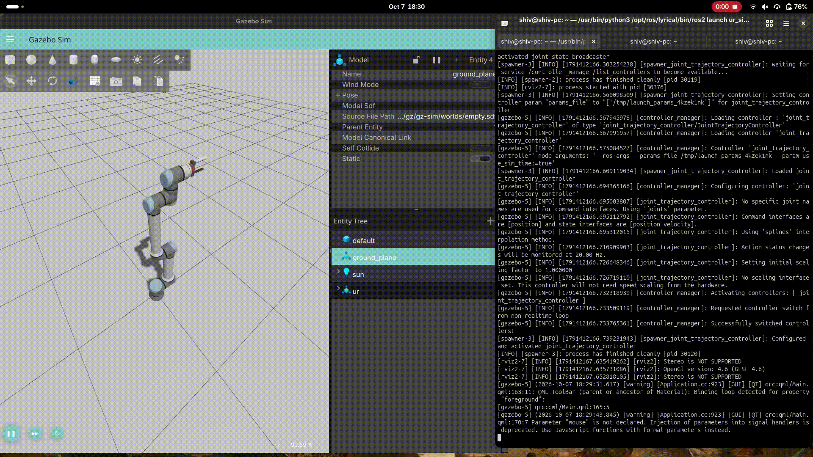

# Autonomous UR10e Pick-and-Place Trajectory Planner

A robust ROS 2 Python control pipeline designed to programmatically command a Universal Robots UR10e manipulator through multi-step industrial pick-and-place routines within a Gazebo simulation environment.


<!-- Drop a 10s GIF or screenshot of your robot running here -->
---

## 🚀 Overview

Industrial automation relies heavily on precise, repeatable trajectory execution. This project bypasses manual GUI jogging to implement a fully autonomous, code-driven control pipeline. Using ROS 2 topic communication, a custom Python node publishes time-parameterized `JointTrajectory` messages to execute smooth, multi-waypoint industrial choreography across a workstation environment.

## 🛠️ Key Features

* **Direct ROS 2 Controller Interface:** Publishes directly to the `joint_trajectory_controller` via `rclpy`.
* **Multi-Waypoint Choreography:** Sequences coordinated joint configurations from a Home state through pick/place workspace zones.
* **Deterministic Timing:** Uses time-parameterized trajectory points (`time_from_start`) for safe, controlled manipulator motion.
* **Gazebo & RViz Integration:** Validated in a physics-enabled simulation environment with custom workstation geometry.

## 🧰 Tech Stack

* **Middleware:** ROS 2 (Humble / Iron / Jazzy)
* **Simulation:** Gazebo (Ignition / GZ) & `ur_simulation_gz`
* **Programming Language:** Python 3 (`rclpy`, `trajectory_msgs`)
* **Robot Hardware Model:** Universal Robots UR10e (6-DOF Manipulator)

---

## ⚙️ Getting Started & Installation

### Prerequisites

Ensure you have ROS 2 and the Universal Robots simulation package (`ur_simulation_gz`) installed.

### Build

```bash
# Clone the repository into your ROS 2 workspace src
cd ~/ur_ws/src
git clone <your-repo-url>

# Build the workspace
cd ~/ur_ws
colcon build --packages-select ur10e_vision_control
source install/setup.bash
```

### Running the Simulation & Control Pipeline

**Terminal 1: Launch the Gazebo simulation and controllers**

```bash
source ~/ur_ws/install/setup.bash
ros2 launch ur_simulation_gz ur_sim_control.launch.py ur_type:=ur10e
```

> **Note:** Ensure the simulation clock is playing in the Gazebo GUI.

**Terminal 2: Execute the trajectory planner node**

```bash
source ~/ur_ws/install/setup.bash
python3 ~/ur_ws/src/ur10e_vision_control/ur10e_vision_control/waypoint_commander.py
```

---

## 📐 Architecture & Control Flow

The control script initializes a ROS 2 node that publishes to the `/joint_trajectory_controller/joint_trajectory` topic.

```text
[ Python Waypoint Node ]
        │ (Publishes JointTrajectory)
        ▼
[ /joint_trajectory_controller/joint_trajectory ]
        │
        ▼
[ ROS 2 Control Hardware Interface ]
        │
        ▼
[ Gazebo Physics Simulation (UR10e) ]
```

Each waypoint specifies target angles for all 6 joints (`shoulder_pan`, `shoulder_lift`, `elbow`, `wrist_1`, `wrist_2`, `wrist_3`) paired with a cumulative timestamp so the controller can interpolate smoothly.

## 🎯 Future Enhancements

* Integrate MoveIt 2 for collision-aware motion planning.
* Add a simulated parallel-jaw gripper actuation service.
* Implement sensor feedback for closed-loop quality verification.

## 👤 Author

**Shivam Dave**
Mechatronics Engineering | Toronto Metropolitan University

[LinkedIn](https://linkedin.com/in/shivamalapdave) | [Portfolio](https://shivam-dave.vercel.app)
